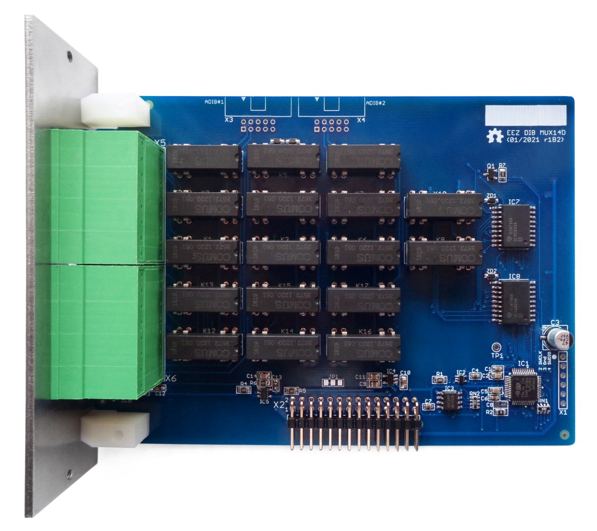

### Ownership and License
The contributors are listed in CONTRIB.TXT.

Licenses | OSHWA UID
--|--
 | 

### Overview

The EEZ DIB MUX14D module features two 7:1 reed relay 2-wire multiplexer that can be connect together to make single 14:1 multiplexer. 

### Feature list

* On-board STM32F030C6T6 or STM32F031C4T6 MCU 
* 2 x 16-pin dual row 3.81 mm connectors
* 2 x ADIB connectors (10-pin 2 mm), ADIB ID=002
* Dual 2-wire 7:1 reed relay 2-line multiplexer 
* On-board +3.3 V LDO
* Firmware download via UART
* Optional SWD for debugging
* I2C EEPROM for storing board specific parameters
* Dimensions: 131 x 95 mm, 2-layer PCB

### r1B2 prototype

### Firmware repository

https://github.com/eez-open/dib-mux14d-fw  
The firmware download procedure is described in [Chapter 13.2]((https://www.envox.eu/eez-bench-box-3/bb3-user-manual/13-firmware-upgrade/#bb3_man_module_upgrade) of the User Manual.

