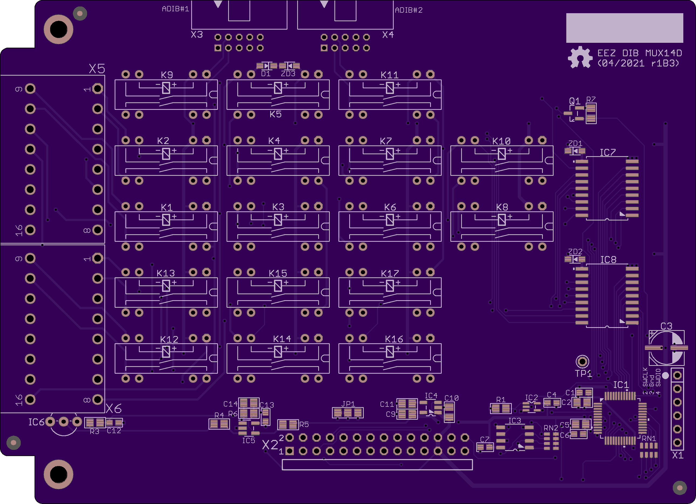

The EEZ DIB MUX14D module features two 7:1 reed relay 2-line multiplexer that can be connect together to make single 14:1 multiplexer. 

### Feature list

* On-board STM32F030C6T6 MCU 
* 2 x 16-pin dual row 3.81 mm connectors
* 2 x ADIB connectors (10-pin 2 mm)
* 2 x 7:1 reed relay 2-line multiplexer 
* On-board +3.3 V LDO
* Firmware download via UART
* Optional SWD for debugging
* I2C EEPROM for storing board specific parameters
* Dimensions: 131 x 95 mm, 2-layer PCB

### r1B2 PCB layout

